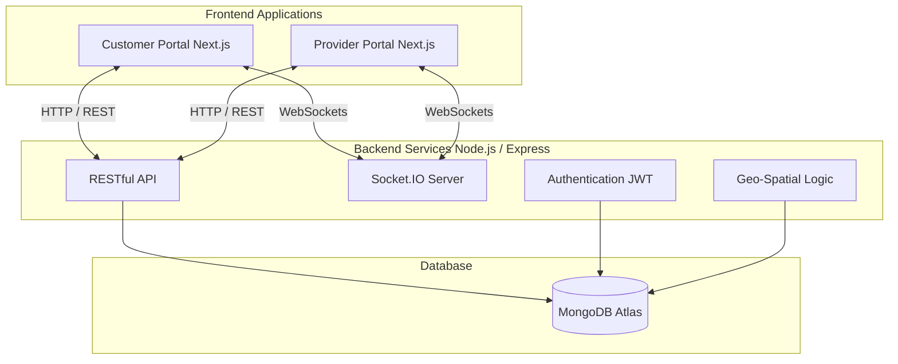

# Comprehensive Project Report: Local Service Finder Web Application

## 1. Executive Summary
The **Local Service Finder Web Application** is a robust, dual-portal platform designed to seamlessly connect customers with local service providers. By leveraging modern web technologies and real-time communication protocols, the application bridges the gap between individuals seeking immediate or scheduled services (such as plumbing, electrical work, cleaning, etc.) and professionals offering these services. The system is built on a scalable architecture consisting of a Node.js/Express backend, a MongoDB database, and two distinct Next.js frontend applications tailored for the end-user (customer) and the service provider. 

Recent system enhancements have introduced high-value features, including real-time chat via Socket.IO, precise geo-location tracking using Leaflet and GeoJSON, and an optimized, frictionless booking experience. This report provides a detailed, granular overview of the project's architecture, data models, API design, frontend components, and strategic development phases.

---

## 2. Introduction & Project Scope

### 2.1 Purpose of the Project
The primary objective of the Local Service Finder is to digitize and streamline the localized gig economy. Traditionally, finding reliable local professionals involves word-of-mouth or browsing disparate directories. This platform centralizes discovery, communication, booking, and reviews into a unified ecosystem.

### 2.2 Target Audience
- **Customers (Users):** Individuals or businesses looking for quick, reliable local services with transparent pricing, verified reviews, and real-time tracking.
- **Service Providers:** Skilled professionals, freelancers, and small businesses seeking a platform to showcase their expertise, manage job requests, and communicate with clients seamlessly.

### 2.3 Key Value Proposition
- **Real-Time Connectivity:** Instant messaging enables rapid negotiation and clarification.
- **Geo-Spatial Accuracy:** Distance-based filtering ensures users only see providers within their immediate vicinity.
- **Dedicated Portals:** Separate, optimized user interfaces for customers and providers ensure that each user type has the exact tools they need.

---

## 3. Technology Stack & Architecture

The application adopts a decoupled, modern JavaScript/TypeScript stack (MERN-inspired but utilizing Next.js for SSR/SSG capabilities).

### 3.1 System Architecture Diagram

### 3.2 Frontend Technologies
- **Framework:** Next.js 14+ (React 19) for both the customer and provider applications, utilizing server-side rendering for optimal performance and SEO.
- **Styling:** Tailwind CSS (v4) for utility-first, responsive, and maintainable styling. The provider portal also integrates Geist UI for a sleek, dashboard-centric look.
- **Maps & Location:** Leaflet and React-Leaflet for interactive map rendering, coordinate picking, and route visualization.
- **Real-Time Communication:** Socket.IO-client for bi-directional event-based communication.

### 3.3 Backend Technologies
- **Runtime & Framework:** Node.js with Express.js (v5.2) handling routing, middleware, and HTTP requests.
- **Real-Time Server:** Socket.IO integrated alongside the HTTP server to handle chat rooms and live status updates.
- **Security:** `bcryptjs` for password hashing and `jsonwebtoken` for stateless, secure API authentication.
- **Database ORM:** Mongoose (v9.5) for strict schema definition, data validation, and complex geospatial querying.

---

## 4. Data Models & Schema Design

The database is normalized across several core entities, establishing strong relational links via MongoDB ObjectIds.

### 4.1 User Schema (`User.js`)
Handles the authentication and profile data for customers.
- **Fields:** `name`, `email` (Unique), `password` (Hashed), `role` (Default: "user").
- **Timestamps:** Automatically generated for `createdAt` and `updatedAt`.

### 4.2 Service Provider Schema (`ServiceProvider.js`)
A highly detailed schema encompassing professional credentials, location data, and metrics.
- **Core Info:** `name`, `email`, `password`, `role` (Default: "provider"), `phone`, `profileImage`.
- **Professional Details:** `specialty` (Customizable field), `bio`, `experience` (Years).
- **Metrics:** `rating`, `averageRating`, `reviewCount`, `totalJobs`.
- **Availability:** `approved` (Admin flag), `available` (Toggle).
- **Geo-Location:** `address`, `city`, `state`, `zip`, `country`. 
  - *Crucial Feature:* `location` field utilizing a GeoJSON `Point` format `[longitude, latitude]`. An index `{ location: "2dsphere" }` is applied to enable highly efficient distance-based queries (e.g., "$near" queries).

### 4.3 Service Request Schema (`ServiceRequest.js`)
Acts as the central transaction record connecting a User and a Service Provider.
- **References:** `user` (ObjectId), `requestedProvider` (ObjectId), `assignedProvider` (ObjectId).
- **Request Details:** `serviceType`, `customServiceType`, `details`, `urgency` (Low, Normal, High, Emergency).
- **Location Context:** `address`, `providerLocation` (Captured lat/lng).
- **State Management:** `status` (Pending, Assigned, In Progress, Completed, Cancelled).
- **Metadata:** `estimatedArrivalTime`, `reviewed` (Boolean flag).

### 4.4 Review Schema (`Review.js`)
Facilitates the reputation system of the platform.
- **References:** `serviceRequest` (Unique per request), `provider`, `customer`.
- **Feedback:** `rating` (1 to 5), `comment`.

### 4.5 Message Schema (`Message.js`)
Stores chat history for the real-time messaging system.
- **Context:** `serviceRequestId` binds the chat to a specific job.
- **Sender Details:** `senderId`, `senderRole` (user vs. provider).
- **Content:** `content` (Text payload).

---

## 5. Core Features & Capabilities

### 5.1 Real-Time Chat System
To prevent miscommunication and ensure smooth service delivery, a WebSockets-based chat system is implemented.
- **Implementation:** When a service request is created, it acts as a unique Socket room (`join_room`). 
- **Flow:** Both the customer and the provider join this room. Messages are emitted via `send_message`, instantly broadcast to the room via `io.to(requestId).emit`, and concurrently saved to the MongoDB `Message` collection for persistence.

### 5.2 Advanced Geo-Location Services
Location is the heartbeat of this application.
- **Provider Settings:** Providers use an interactive Leaflet map to drop a pin, pinpointing their exact coordinates, which are saved as GeoJSON.
- **Customer Search:** Customers utilizing the "Near Me" feature trigger a geospatial query. The backend uses Mongoose's `$near` operator on the `2dsphere` index to return providers sorted by proximity, calculating exact distances in kilometers.

### 5.3 Streamlined Service Request Flow
The booking flow is optimized for conversion.
- **Pre-filled Data:** Saved addresses from the user's profile (`choose-location` page) are dynamically fetched and pre-filled into the `request-service` form, eliminating redundant typing.
- **Custom Specialties:** Users can select predefined categories or type a `customServiceType` to handle niche requests, matching the custom specialties defined by providers during their signup phase.

---

## 6. Frontend Applications Breakdown

### 6.1 Customer Portal (`Frontend/nextjs`)
Designed for intuitive discovery and monitoring.
- **/providers:** Displays a grid/list of local professionals. Includes filters for distance, rating, and specialty.
- **/choose-location & /add-address:** Interface for managing the user's address book, integrating map-based selection.
- **/request-service:** The primary booking form, deeply integrated with the user's saved locations.
- **/track:** A live dashboard allowing the customer to see the status of their active request (Pending -> Assigned -> In Progress) and initiate chat.

### 6.2 Provider Portal (`Frontend/serviceprovider`)
Designed as a command center for professionals to manage their business.
- **/dashboard:** An overview of active requests, earnings, and recent reviews.
- **/profile:** Allows the provider to update their bio, custom specialties, and precise map coordinates.
- **Request Management:** UI elements to accept, decline, or update the status of incoming service requests.

---

## 7. Backend API Specification

The Express backend exposes a comprehensive RESTful API, structured cleanly using Express Routers.

### 7.1 Authentication (`/api/auth`)
- `POST /register`: Hashes password, creates User/Provider, returns JWT.
- `POST /login`: Validates credentials, issues JWT containing role and ID.

### 7.2 Provider Discovery (`/api/providers`)
- `GET /`: Lists providers (with pagination and filtering).
- `GET /nearby`: Accepts `lat` and `lng` query params, utilizing the `2dsphere` index to return providers within a specified radius.
- `GET /:id`: Fetches detailed profile data, including populated reviews.

### 7.3 Service Requests (`/api/requests`)
- `POST /`: Creates a new service request.
- `GET /user/:id`: Fetches all requests made by a specific customer.
- `GET /provider/:id`: Fetches all jobs assigned/requested to a provider.
- `PUT /:id/status`: Allows providers to update the job state (e.g., to "In Progress").

### 7.4 Chat & Reviews (`/api/chat`, `/api/reviews`)
- `GET /api/chat/:requestId`: Retrieves the historical message log for a specific job.
- `POST /api/reviews`: Submits a new rating, concurrently updating the provider's `averageRating` and `reviewCount`.

---

## 8. Development History & Strategic Enhancements

The project has undergone several key iteration phases, as documented in the development logs:

1. **Foundation & Aesthetics (Late April 2026):** Focused on establishing the Next.js infrastructure and enhancing the UI/UX. Emphasis was placed on modern web design, vibrant aesthetics, and a polished user experience.
2. **Real-Time Communication Integration:** Implemented the Socket.IO infrastructure, creating the `Message` model and integrating the chat UI into the request tracking pages.
3. **Customized Specialist Fields:** Enhanced the provider registration flow to allow for niche, customized service offerings, modifying the backend schema and frontend forms accordingly.
4. **Streamlined Booking Experience:** Integrated the address management system directly with the booking form, reducing friction by pre-filling location data.
5. **Geo-Spatial Overhaul (Early May 2026):** Upgraded the "Near Me" search to utilize rigorous coordinate-based metrics (kilometers). Integrated the map-based coordinate picker in the provider profile settings to ensure pinpoint accuracy for service area mapping.

---

## 9. Scalability, Security, & Best Practices

- **Security:** All sensitive routes are protected by JWT middleware. Passwords are never stored in plaintext. Cross-Origin Resource Sharing (CORS) is explicitly configured to ensure safe client-server communication.
- **Database Efficiency:** The use of `2dsphere` indexing drastically reduces the computational overhead of distance calculations.
- **Real-time Scalability:** While currently using a single Node.js instance for Socket.IO, the architecture is designed such that it can be easily adapted to use a Redis adapter for horizontal scaling of WebSockets across multiple server instances.

---

## 10. Conclusion & Future Roadmap

The Local Service Finder Web Application represents a highly cohesive, full-stack solution tailored for the modern gig economy. By combining Next.js's fast rendering with a robust Express/MongoDB backend and real-time Socket.IO capabilities, it delivers a premium, frictionless experience for both customers and professionals.

### Future Enhancements (Roadmap):
1. **Payment Gateway Integration:** Incorporating Stripe or PayPal to handle in-app transactions and escrow services safely.
2. **Push Notifications:** Integrating Firebase Cloud Messaging (FCM) or Web Push API to alert users and providers of messages or status changes even when the app is backgrounded.
3. **Advanced AI Matching:** Implementing an algorithmic recommendation engine that pairs customers with providers based on complex criteria including past behavior, specialized semantic matching of request details, and dynamic pricing models.
4. **Mobile Applications:** Porting the responsive web views into native iOS and Android applications using React Native, utilizing the exact same backend API structure.
